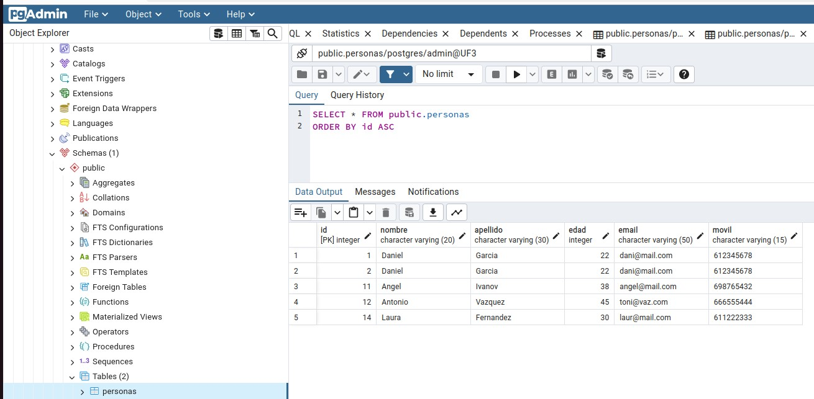

# M7_UF3

Imatges de la pràctica2 (CRUD) de Postgres:
- execució del fitxer Main.py

- la taula personas sense la entrada del nou usuari

- entrada de dades (insert)

- la taula personas amb les dades del nou usuari

- el read.py executat que mostra les dades de l'usuari. S'executa l'update del camp movil

 - update del movil realitzat 

- movil actualitzat a la taula personas

- esborrem l'ultim usuari

- mostrem la taula amb el darrer registre esborrat

  
